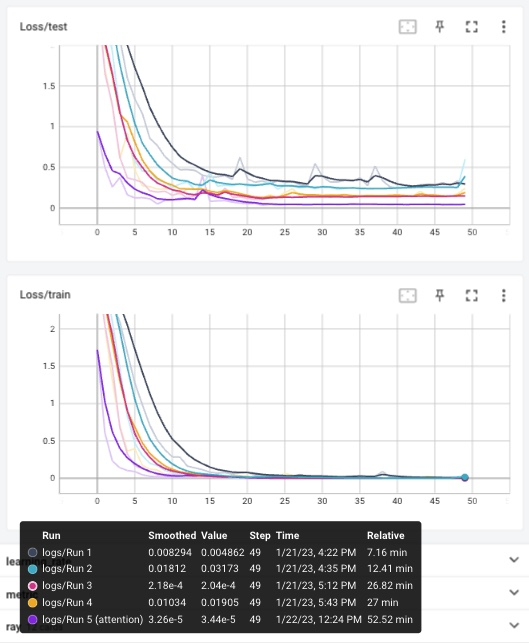
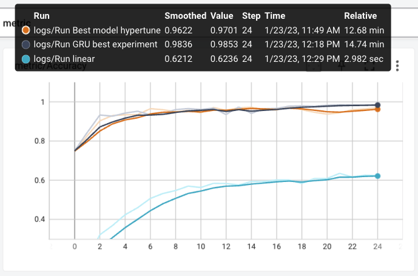

# Tentamen ML2022-2023

De opdracht is om de audio van 10 cijfers, uitgesproken door zowel mannen als vrouwen, te classificeren. De dataset bevat timeseries met een wisselende lengte.

In [references/documentation.html](references/documentation.html) lees je o.a. dat elke timestep 13 features heeft.
Jouw junior collega heeft een neuraal netwerk gebouwd, maar het lukt hem niet om de accuracy boven de 67% te krijgen. Aangezien jij de cursus Machine Learning bijna succesvol hebt afgerond hoopt hij dat jij een paar betere ideeen hebt.

## Vraag 1

### 1a
In `dev/scripts` vind je de file `01_model_design.py`.
Het model in deze file heeft in de eerste hidden layer 100 units, in de tweede layer 10 units, dit heeft jouw collega ergens op stack overflow gevonden en hij had gelezen dat dit een goed model zou zijn.
De dropout staat op 0.5, hij heeft in een blog gelezen dat dit de beste settings voor dropout zou zijn.

- Wat vind je van de architectuur die hij heeft uitgekozen (een Neuraal netwerk met drie Linear layers)? Wat zijn sterke en zwakke kanten van een model als dit in het algemeen? En voor dit specifieke probleem?

---
###  **Antwoord:**
De keuze voor een relatief simpel neuraal netwerk met drie lagen ligt voor de hand om mee te starten bij een simpele dataset. Deze bevat een input layer, hidden layer en een output layer. Het sterke punt is dat dit model snel en simpel een baseline creëert en overfitting voorkomt. Het zwakke punt is dat de accuratie hoogstwaarschijnlijk te verbeteren is, mede omdat het gekozen model niet optimaal is voor deze data. Een ander model, zoals een RNN, zou geschikter zijn voor timeserie met een volgordelijkheid. 

---

- Wat vind je van de keuzes die hij heeft gemaakt in de LinearConfig voor het aantal units ten opzichte van de data? En van de dropout?

---
###  **Antwoord:**
Analyse keuzes LinearConfig:
- Input 13: Dit aantal is gelijk aan het aantal attributen en klopt;
- H1 100: In de les is naar voren gekomen dat voor 10 classes, de filterinstelling rond de 100 zou moeten zijn. Ik zou persoonlijk kiezen voor 256 omdat het 20 classes betreft. Redenatie is 100 is geschikt voor 10, dus 20 voor 200. Daarnaast wil ik de stappen (filter x 2) tussen 8 t/m 512 kunnen maken, dus in plaats van 200 is 256 een logische keuze. De resultaten van de tussentijdse opdracht bevestigen deze keuze (256 heeft daar de beste resultaten gegeven).
- H2 10: Om deze beter te laten aansluiten met H1 en de Output zou ik deze op 64 zetten. 
- Output 20: Is gelijk aan het aantal classes (0 t/m 9 voor man en vrouw). Indien het alleen de cijfers betreft, zonder man/vrouw classificatie dan zou dit 10 moeten zijn. 
- Dropout 0,5: Dit lijkt, voor een relatief kleine dataset, aan de hoge kant met 0,5 (= een verlies van de helft). Een acceptabele start van de dropout lijkt mij 0,2. Ook is het te overwegen om geen dropout te gebruiken voor relatief simpele dataset en een simpel linear model, welke ook al overfitting tegen gaat.
---

## 1b
Als je in de forward methode van het Linear model kijkt (in `tentamen/model.py`) dan kun je zien dat het eerste dat hij doet `x.mean(dim=1)` is. 

- Wat is het effect hiervan? Welk probleem probeert hij hier op te lossen? (maw, wat gaat er fout als hij dit niet doet?)

---
###  **Antwoord:** 
Met de code bepaalt men hoe de mean wordt berekend, in dit geval vanuit twee dimensies. Door deze stap te nemen zoekt de collega aansluiting tussen de data en het simpele lineaire model. Zonder aansluiting tussen de data en het model, zal het model veel verwerkingstijd nodig hebben of in het slechtste geval niet (goed) werken. 

---

- Hoe had hij dit ook kunnen oplossen?

---
###  **Antwoord:** 
Door het toepassen van een average pooling 2D functie in het model wordt hetzelfde resultaat bereikt. 

---

- Wat zijn voor een nadelen van de verschillende manieren om deze stap te doen?

---
###  **Antwoord:**
Average pooling geeft de gemiddelde waarde. Het nadeel is een lagere kwaliteit in contrast door het gemiddelde, terwijl het voordeel is dat average pooling in staat is de plaatjes beter te extraheren (minder effect op de waardes). 

---

### 1c
Omdat jij de cursus Machine Learning hebt gevolgd kun jij hem uitstekend uitleggen wat een betere architectuur zou zijn.

- Beschrijf de architecturen die je kunt overwegen voor een probleem als dit. Het is voldoende als je beschrijft welke layers in welke combinaties je zou kunnen gebruiken.

---
###  **Antwoord:** 
Ik zou een model gebruiken geschikt voor sequentiële timeserie data, zoals text en spraak, en met het vermogen om waardes te onthouden, zoals een RNN, LSTM of GRU model. Een GRU is relatief simpel ten opzichte van een LSTM en een LSTM is minder geschikt voor deze simpele dataset. Een losstand RNN model zou mogelijk problemen met het geheugen kunnen krijgen, terwijl de GRU variant dit oplost. In principe zijn alle genoemde modellen te gebruiken, echter lijkt in dit geval de GRU de beste optie te zijn. 

---

- Geef vervolgens een indicatie en motivatie voor het aantal units/filters/kernelsize etc voor elke laag die je gebruikt, en hoe je omgaat met overgangen (bv van 3 naar 2 dimensies). Een indicatie is bijvoorbeeld een educated guess voor een aantal units, plus een boven en ondergrens voor het aantal units. Met een motivatie laat je zien dat jouw keuze niet een random selectie is, maar dat je 1) andere problemen hebt gezien en dit probleem daartegen kunt afzetten en 2) een besef hebt van de consquenties van het kiezen van een range.

---
###  **Antwoord:** 
Voorgestelde instellingen GRU model:
- Learning rate: Op basis van de uitkomsten tussentijdse opdracht is de instelling learning rate le-3 / 0,001 het beste gebleken voor de classificatie.
- Input: 13, betreft het aantal attributen.
- Hidden size: 64 lijkt een mooie instelling om te starten. Dit ondanks dat bij vraag 1a is aangeven dat 256 hoogstwaarschijnlijk de beste resultaten geeft start ik bij 64, vervolgens 128 en werk naar 256 toe.
- Output: 20 conform het aantal classes.
- Loss function: Cross-Entropy-Loss, omdat deze passend is voor een classificatie.
- Optimizer: Adam, omdat deze optimizer wordt gezien als een van de betere optimizers en minder parameters nodig heeft. Dit is ook gebleken uit de resultaten van de tussentijdse opdracht.
- Num layers: Deze zou ik op 4 zetten zodat er voldoende lagen zijn om het model te trainen.
- Dimensies: Mocht de modelkeuze het nodig hebben dan zou een flatten optie de dimensies kunnen aanpassen.
---

- Geef aan wat jij verwacht dat de meest veelbelovende architectuur is, en waarom (opnieuw, laat zien dat je niet random getallen noemt, of keuzes maakt, maar dat jij je keuze baseert op ervaring die je hebt opgedaan met andere problemen).

---
###  **Antwoord:**
Zoals eigenlijk al aangegeven bij de beantwoording van eerdere vragen zou ik gaan voor een GRU model omdat deze geschikt is voor een timeserie classificatie en het mogelijke geheugen probleem oplost. De loss functie passend bij een classificatie is Cross-Entropy-Loss. Voor de learning rate is is gekozen voor le-3 / 0,001, mede door de resultaten uit de tussentijdse opdracht. De optimizer is adam, omdat deze als een van de betere optimizer wordt gezien. Dit is ook gebleken tijdens het experiment van de tussentijdse opdracht. De num_layers op 4 zodat er voldoende lagen zijn voor een juiste training. De hidden size start bij 64, echter is de verwachting dat 256 betere resultaten geeft. De input blijft gelijk aan het aantal attributen van 13 en de output op het aantal classes 20.

Daarnaast ga ik voor 1 run met de beste instellingen een test houden wat het verschil is tussen een gewone GRU en een GRU attention.

---

## 1d
Implementeer jouw veelbelovende model: 

- Maak in `model.py` een nieuw nn.Module met jouw architectuur
- Maak in `settings.py` een nieuwe config voor jouw model

---
###  **Antwoord:** 
Een aantal acties zijn uitgevoerd om het model te introduceren, namelijk:
- Creatie van 01D_gru_model_design.py ten behoeve van het reguliere GRU model.
- Creatie van 01D_gruatt_model_design.py ten behoeve van het GRU attention model.
- Toevoeging settings beide modellen in settings.py.
- Toevoegen/aanpassen aanroepen modellen in Makefile met *'make run_linear', 'make run_gru'* en *'make run_gruatt'*. 

---

- Train het model met enkele educated guesses van parameters. 

---
###  **Antwoord:** 
Om het model te trainen zijn er een vijftal runs uitgevoerd, namelijk:

**RUN 1:** Voor de eerste run is het model getraind met de volgende parameters: 
- Input: 13.
- Hidden size: 64.
- Output: 20.
- Num_layers: 4.
- Dropout: 0,2.

**RUN 2:** Voor de tweede run is alleen de hidden size gewijzigd van 64 naar 128. De reden hiervoor is de input vanuit de les, dat voor 20 classes de filters rond de 200 moeten zijn (dus 256 voor een x 2 effect).

**RUN 3 (1e poging):** Voor de derde run heb ik geprobeerd om de output op 10 te zetten omdat ik twijfel of de output 20 wel de juiste is (getal 0 t/m 9 voor man en vrouw (=20) -> of alleen 0 t/m 9 (=10)). Door de aanpassing van 20 naar 10 krijgt de training een foutmelding, wat impliceert dat 20 de juiste output is.

**RUN 3 (2e poging):** Voor de tweede poging van de derde run is de hidden size gewijzigd van 128 naar 256. De reden hiervoor is dat de accuratie in de tweede run omhoog is gegaan.

**RUN 4:** Uit nieuwsgierigheid van de dropout effecten heb ik toch een vierde run uitgevoerd waarin de instellingen van de derde run zijn gebruikt. Uitzondering is de dropout, deze is van 0,2 naar 0,5 ingesteld.

**RUN 5:** Als laatste is het gru attention model gebruikt met de beste instellingen (van run 3).

***NB: in de zwarte blokken van de visualisatie staat aangegeven welke kleur bij run 1, 2, 3, 4 en/of 5 hoort.***

---

- Rapporteer je bevindingen. Ga hier niet te uitgebreid hypertunen (dat is vraag 2), maar rapporteer (met een afbeelding in `antwoorden/img` die je linkt naar jouw .md antwoord) voor bijvoorbeeld drie verschillende parametersets hoe de train/test loss curve verloopt.

---
###  **Antwoord:** 
<figure>
  

    
    <figcaption align="center">
      <b> Fig 1. Uitkomsten GRU trainingen (Y as = Accuratie / X as = Aantal Epochs)</b>
    </figcaption>
  

</figure>
In totaal zijn er vier runs uitgevoerd met de volgende instellingen:

- Run 1: De accuratie is 0,9444 (input 13, hidden size 64, output 20, num_layers 4, dropout 0,2).
- Run 2: De accuratie is 0,9586 (input 13, **hidden size 128**, output 20, num_layers 4, dropout 0,2).
- Run 3: De accuratie is 0,9733 (input 13, **hidden size 256**, output 20, num_layers 4, dropout 0,2).
- Run 4: De accuratie is 0,9667 (input 13, hidden size 256, output 20, num_layers 4, **dropout 0,5**).
- Run 5 (attention): De accuratie is 0,9867 (input 13, hidden size 256, output 20, num_layers 4, dropout 0,2). **Voor deze run is het gru model met attention gebruikt.**

---
<figure>
  

    
    <figcaption align="center">
      <b> Fig 2. Uitkomsten GRU LOSS (Y as = Loss / X as = Aantal Epochs)</b>
    </figcaption>
  

</figure>
In de vier runs is de loss als volgt waargenomen:

- Run 1: Deze run geeft zowel in de train, als test, een minder resultaat. De loss is significant hoger in de test en er zijn ook veel uitschieters zichtbaar. Dit duidt mogelijk op overfitting.
- Run 2: Ook deze run geeft in de train, als test, een minder resultaat. Al is er vooruitgang ten opzichte van run 1. De loss is nog redelijk hoog met een enkele uitschieter.
- Run 3: Deze run presteert zichtbaar het beste. Het model leert goed en er zijn geen signalen van bijvoorbeeld overfitting.
- Run 4: Op zich presteert deze run ook goed, echter ten opzichte van run 3 zijn er tijdens de test meer uitschieters zichtbaar.
- Run 5: Door de toevoeging van een attention laag in het GRU model, met de instellingen van run 3, is de accuratie verder om hoog gegaan en de loss gedaald.

---

- reflecteer op deze eerste verkenning van je model. Wat valt op, wat vind je interessant, wat had je niet verwacht, welk inzicht neem je mee naar de hypertuning.

---
###  **Antwoord:**

Zoals verwacht gaf hidden_size 256 de beste resultaten. Het is goed om te zien dat met een redenatie op boerenverstand en ervaring vanuit de tussentijdse opdracht al een goede richting kan geven aan een model. Wat verrassend was, is dat het wijzigen van de dropout (0,2 -> 0,5) weinig effect had op de uitkomst. Ook heb ik 4 runs gedaan met 50 epochs elk. In zowel de train als test is te zien dat de uitkomsten tussen de 20 en 25 epochs verzadigd raken. Het kan dus tijd schelen om in plaats van 50 voor 25 epochs te gaan. Dit scheelt significant in o.a. de tijdsduur. Omdat ik twijfels had over de output (0 t/m 9 totaal = 10 of 0 t/m 9 voor man én vrouw = 20) heb ik geprobeerd de output op 10 te laten draaien, maar hier kreeg ik een foutmelding. Dit suggereert dat de output goed staat op 20.

Al met al is een accuratie van ruim 97% voor een eerste aanzet al behoorlijk goed en ben ik tevreden met het resultaat voor het gewone GRU model. Het GRU model met de attention laag heeft een nog betere accuratie van een dikke 98%. Dit is een mooi resultaat voor een verkenning.  

---

## Vraag 2
Een andere collega heeft alvast een hypertuning opgezet in `dev/scripts/02_tune.py`.

### 2a
Implementeer de hypertuning voor jouw architectuur:
- zorg dat je model geschikt is voor hypertuning
- je mag je model nog wat aanpassen, als vraag 1d daar aanleiding toe geeft. Als je in 1d een ander model gebruikt dan hier, geef je model dan een andere naam zodat ik ze naast elkaar kan zien.
- Stel dat je je model aanpast, laat dan je code zien (bv 2e model met aanpassing).
- voeg jouw model in op de juiste plek in de `tune.py` file.

---
###  **Antwoord:**
Het bestand 02_tune.py is aangevuld met het hypertune GRU model en bijpassende instellingen in settings.py. De input is gemarkeerd met # TOEVOEGING TBV VRAAG 2A.

---

- maak een zoekruimte aan met behulp van pydantic (naar het voorbeeld van LinearSearchSpace), maar pas het aan voor jouw model.

---
###  **Antwoord:**
De zoekruimte is aangepast van LinearSearchSpace naar GRUmodelSearchSpace, zoals opgenomen in settings.py.

---

- Licht je keuzes toe: wat hypertune je, en wat niet? Waarom? En in welke ranges zoek je, en waarom? Zie ook de [docs van ray over search space](https://docs.ray.io/en/latest/tune/api_docs/search_space.html#tune-sample-docs) en voor [rondom search algoritmes](https://docs.ray.io/en/latest/tune/api_docs/suggestion.html#bohb-tune-search-bohb-tunebohb) voor meer opties en voorbeelden.

---
###  **Antwoord:**
Om de waardevolle resultaten uit de eerste verkenning vraag 1 te benutten is bij het hypertunen gebruik gemaakt van het GRU model. Hierbij zijn de volgende setting gebruikt:
- Hidden size: Tussen de 64 en 256 conform experiment vraag 1.
- Num layers: Tussen de 2 en 6 omdat tijdens het experiment al ruim 98% accuratie zichtbaar was met 4 layers.
- Dropout: Tussen 0,1 en 0,4 om te bezien welke instelling het beste presteert, zonder teveel verlies van data.
- Batchsize: Omdat het niet geheel duidelijk is welke batchsize een goede output geeft is een brede scope genomen van tussen 32 en 512.
- Epoch: Wordt initieel ingesteld op 5 om een te lange draaitijd te voorkomen.

---

### 2b
- Analyseer de resultaten van jouw hypertuning; visualiseer de parameters van jouw hypertuning en sla het resultaat van die visualisatie op in `reports/img`. Suggesties: `parallel_coordinates` kan handig zijn, maar een goed gekozen histogram of scatterplot met goede kleuren is in sommige situaties duidelijker! Denk aan x en y labels, een titel en units voor de assen.

---
###  **Antwoord:**
Er zijn een drietal runs hypertune uitgevoerd zoals onderstaand beschreven:

**RUN 1 Hypertune:**

<figure>
  

    
    <figcaption align="center">
      <b> Fig 3. Run 1 Hypertune</b>
    </figcaption>
  

</figure>

De uitkomt van run 1 geeft onvoldoende duidelijke resultaten om een goed oordeel te vellen. Daarom is gekozen om een tweede run te draaien met de epochs op 15 (ipv 5) en dezelfde instellingen.

**RUN 2 Hypertune:**

<figure>
  

    
    <figcaption align="center">
      <b> Fig 4. Run 2 Hypertune</b>
    </figcaption>
  

</figure>

Aanpassingen naar aanleiding van de resultaten run 2:
- Hidden van 64 tot 256, naar 128 tot 256. 
- Num_layers van 2 tot 6, naar 4 tot 6. 
- Batchsize van 32 tot 512, naar 128 tot 512.
- Epochs van 15 naar 25.

In zijn algemeenheid is over bovenstaande aantallen te zien dat de meeste en veelbelovende activiteiten in de hogere aantallen liggen, vandaar dat de aantallen van de ondergrens zijn opgehoogd.

**RUN 3 Hypertune:**

<figure>
  

    
    <figcaption align="center">
      <b> Fig 5. Run 3 Hypertune</b>
    </figcaption>
  

</figure>

Naar Hidden 227, num_layer 4, dropout 0,18, batch size 211.

TOELICHTING

---

- reflecteer op de hypertuning. Wat werkt wel, wat werkt niet, wat vind je verrassend, wat zijn trade-offs die je ziet in de hypertuning, wat zijn afwegingen bij het kiezen van een uiteindelijke hyperparametersetting.

---
###  **Antwoord:**
TOELICHTING 

---

Importeer de afbeeldingen in jouw antwoorden, reflecteer op je experiment, en geef een interpretatie en toelichting op wat je ziet.

### 2c
- Zorg dat jouw prijswinnende settings in een config komen te staan in `settings.py`, en train daarmee een model met een optimaal aantal epochs, daarvoor kun je `01_model_design.py` kopieren en hernoemen naar `2c_model_design.py`.

---
###  **Antwoord:**

De beste settings volgens hypertuning zijn als volgt:
- Input: 13
- Hidden: 212
- Output: 20
- Dropout: 0,18
- Num Layers: 4
- Learning rate: le-3 / 0,001
- Epochs: 25
- Batch size: 2

Het beste model, met de beste instellingen, zijn toegevoegd in bestand 2c_model_design.py is in aanroepbaar via *'make run_bestmodel'*. 

De resulaten van het beste model zijn onderstaand zichtbaar. Opvallend is dat het best model (run best model 1), niet de beste resultaten geeft. Het model uit het experiment geeft de beste resultaten (run best model 2). Om het het een en ander in perpectief te brengen is ook het lineaire model toegevoegd. 

<figure>
  

    
    <figcaption align="center">
      <b> Fig 6. Accuratie best model</b>
    </figcaption>
  

</figure>

---

## Vraag 3
### 3a
- fork deze repository.

---
###  **Antwoord:**
De repository is gefork en beschikbaar via https://github.com/Bart691/ML22-tentamen.

---

- Zorg voor nette code. Als je nu `make format && make lint` runt, zie je dat alles ok is. Hoewel het in sommige gevallen prima is om een ignore toe te voegen, is de bedoeling dat je zorgt dat je code zoveel als mogelijk de richtlijnen volgt van de linters.

---
###  **Antwoord:**
Door het runnen van make format && make lint is de code gecontroleerd en waar nodig gecorrigeerd. Het betreft een aantal kleine aanpassingen zoals het verwijderen van een mixed case.

---

- We werken sinds 22 november met git, en ik heb een `git crash coruse.pdf` gedeeld in les 2. Laat zien dat je in git kunt werken, door een git repo aan te maken en jouw code daarheen te pushen. Volg de vuistregel dat je 1) vaak (ruwweg elke dertig minuten aan code) commits doet 2) kleine, logische chunks van code/files samenvoegt in een commit 3) geef duidelijke beschrijvende namen voor je commit messages

---
###  **Antwoord:**
Ik heb vanaf de start van de opdracht gewerkt via de bovenstaande methodiek door regelmatig de code te pushen met duidelijke beschrijvingen. Dit is terug te zien via https://github.com/Bart691/ML22-tentamen.

---

- Zorg voor duidelijke illustraties; voeg labels in voor x en y as, zorg voor eenheden op de assen, een titel, en als dat niet gaat (bv omdat het uit tensorboard komt) zorg dan voor een duidelijke caption van de afbeelding waar dat wel wordt uitgelegd.
- Laat zien dat je je vragen kort en bondig kunt beantwoorden. De antwoordstrategie "ik schiet met hagel en hoop dat het goede antwoord ertussen zit" levert minder punten op dan een kort antwoord waar je de essentie weet te vangen. 
- nodig mij uit (github handle: raoulg) voor je repository. 
